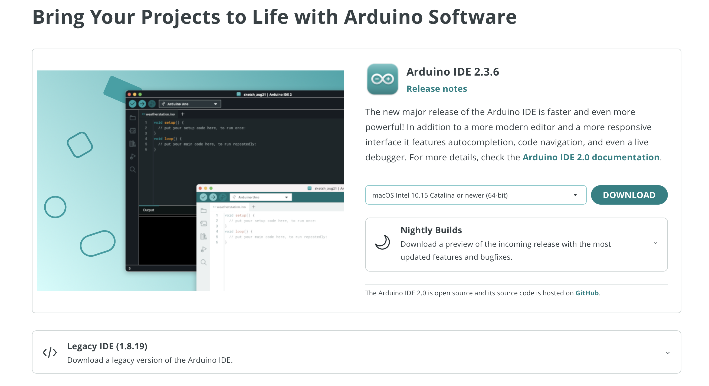
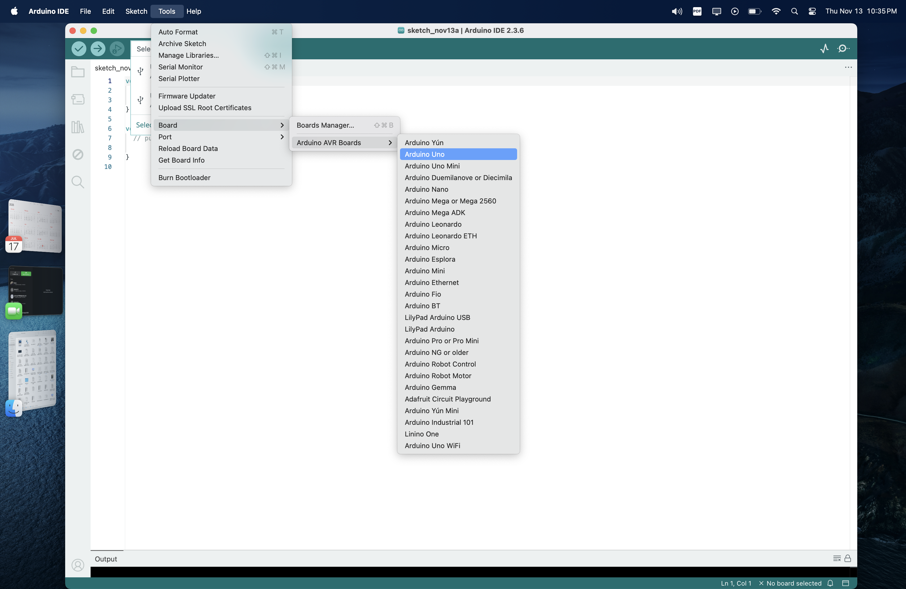
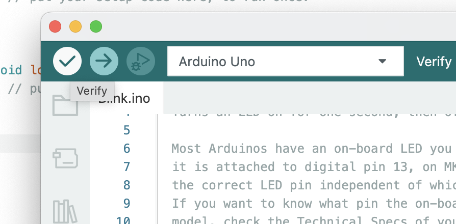
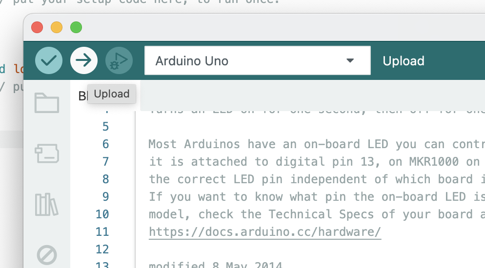

# Arduino IDE 2.3.6 – Download, Install & First Connection Guide

This guide will help tell you how to:

1. Download and install **Arduino IDE 2.3.6**
2. Connect an **Arduino Uno/Nano** to **Windows or macOS**
3. Upload the classic **Blink** example to test everything


---

## 1. Download Arduino IDE 2.3.6

1. Open up chrome and go to:  
   https://www.arduino.cc/en/software  
   <!-- Screenshot idea: Arduino software download page -->
    

3. Under **“Arduino IDE 2.x”**, look for **Version 2.3.6**.

4. Choose the correct download for your operating system:
   - **Windows** → usually “Windows Installer”
   - **macOS** → “Mac OS X 10.14: ARM / Intel” (choose the chip that matches your Mac)

5. Download the installer / DMG file.

---

## 2. Installing on Windows

### 2.1 Run the Installer

1. Find the downloaded file, something like:  
   `arduino-ide_2.3.6_Windows_64bit.exe`
   <!--  -->

2. Double-click it. If Windows asks:
   > *Do you want to allow this app to make changes to your device?*  
   Click **Yes**.

3. Follow the setup wizard:
   - Click **Next** through the steps
   - Accept the **license agreement**
   - Keep the **default options** unless you know what you’re changing

4. When it asks to install **drivers**, click **Install** or **Allow**.

### 2.2 Finish & Launch

1. Once installation completes, check **“Launch Arduino IDE”** or:
   - Open it from the **Start Menu** (`Arduino IDE`).
   <!--  -->

2. You should now see **Arduino IDE 2.3.6** with a default sketch open.

---

## 3. Installing on macOS

### 3.1 Install from DMG

1. Find the downloaded `.dmg`, for example:  
   `arduino-ide_2.3.6_MacOS_64bit.dmg`
   <!--  -->

2. Double-click the `.dmg` file. A window should open with the **Arduino IDE** icon.

3. Drag the **Arduino IDE** icon into the **Applications** folder.
   <!--  -->

### 3.2 First Launch (Gatekeeper)

1. Open **Finder → Applications**.
2. Right-click (or `Ctrl + click`) on **Arduino IDE** and choose **Open**.
3. If macOS shows a security warning (unidentified developer):
   - Click **Open**, or  
   - Go to **System Settings → Privacy & Security**, scroll down, and click **Open Anyway** for Arduino IDE.

4. Arduino IDE 2.3.6 should now launch.
    

---

## 4. Connecting the Arduino Board

You can do this on **Windows or macOS**. The steps are very similar.

### 4.1 Plug in the Board

1. Connect your **Arduino Uno/Nano** to the computer using a USB cable.
2. The **power LED** on the board should turn on.
   !--  -->

---

### 4.2 Select the Board in Arduino IDE

1. Open **Arduino IDE 2.3.6**.
2. Look at the **top toolbar** – you’ll see an area showing the selected **board** and **port**.
   <!--  -->

3. Click on the **board** dropdown:
   - Choose **Arduino Uno** (or the exact board you’re using).

If you don’t see it:

- Go to **Tools → Board → Arduino AVR Boards → Arduino Uno**.

---

### 4.3 Select the Port

This tells Arduino IDE which USB connection is your board.
 !-- 
#### On Windows

1. In Arduino IDE, either:
   - Click the **Port** dropdown in the top bar, or
   - Go to **Tools → Port**

2. Look for something like:
   - `COM3 (Arduino Uno)`
   - or `COM4 (Arduino Uno)`

3. Select that port.

> 💡 Tip: If you’re not sure which COM port is the Arduino:
> - Unplug the board and check which COM port disappears.
> - Plug it back in and see which one appears again.

#### On macOS

1. In Arduino IDE:
   - Go to **Tools → Port**.

2. Look for something like:
   - `/dev/cu.usbmodemXXXX` (for official Arduino)
   - Or `/dev/cu.usbserial-XXXX` (for some clones)

3. Select the port that appears when the board is connected.

> 💡 Same trick: unplug → port disappears; plug in → port appears.

---

## 5. Testing with the Blink Example

Now we test if everything is working by blinking the built-in LED.
 ```
void setup() {
  // initialize digital pin LED_BUILTIN as an output.
  pinMode(LED_BUILTIN, OUTPUT);
}

// the loop function runs over and over again forever
void loop() {
  digitalWrite(LED_BUILTIN, HIGH);  // turn the LED on (HIGH is the voltage level)
  delay(1000);                      // wait for a second
  digitalWrite(LED_BUILTIN, LOW);   // turn the LED off by making the voltage LOW
  delay(1000);                      // wait for a second
}
```

1. Click the **✔ Verify** button (top-left in the toolbar).
   !--  --

2. Wait for the output at the bottom to say something like:
   > *“Compilation complete”*  
   or  
   > *“Done compiling”*

3. If you see errors, double-check:
   - You haven’t accidentally edited the code in a bad way
   - Board is selected correctly (Arduino Uno)

### 5.3 Upload the Sketch

1. Confirm the correct:
   - **Board** is selected (Arduino Uno)
   - **Port** is selected (COMx on Windows, `/dev/cu.*` on macOS)

2. Click the **→ Upload** button (right of Verify).
   !--  -->

3. The bottom status area will say:
   - *Compiling...*
   - *Uploading...*
   - *Done uploading.*

4. Look at your Arduino board:
   - The **built-in LED** (usually labeled `L`) should blink once per second.

If it’s blinking – 🎉 congratulations, your setup works!

---
